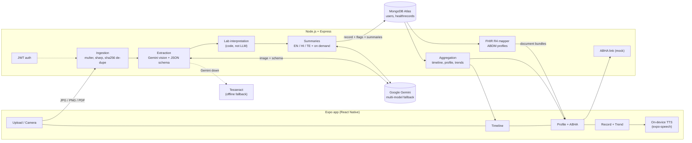
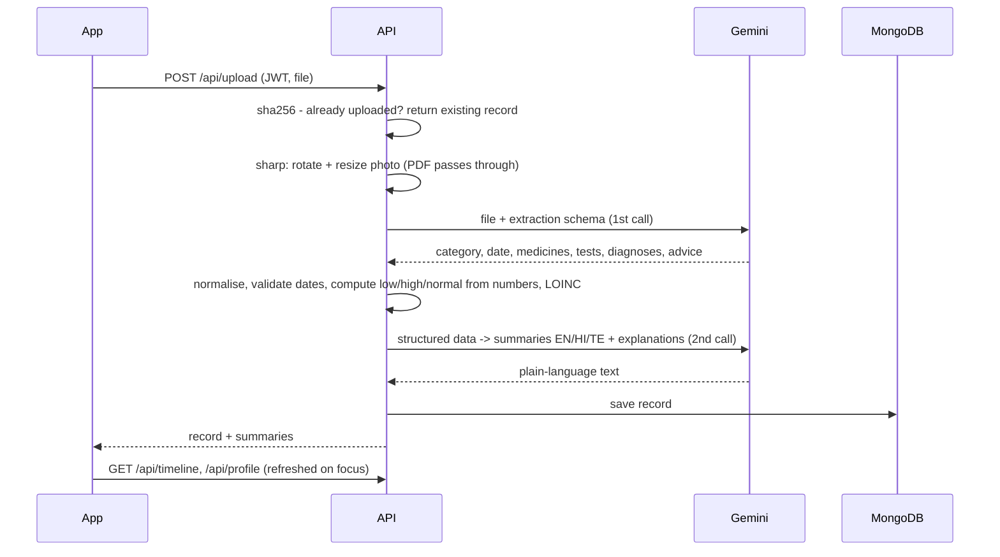

# Spirit Health Copilot

AI-powered personal health copilot: photograph or upload a prescription, lab report or discharge summary and get the data
extracted, explained in plain language (English, हिन्दी, తెలుగు, தமிழ்), and filed into one health timeline / profile
that is shaped for ABDM (FHIR R4).

| | |
|---|---|
| App | React Native (Expo SDK 57, expo-router, TypeScript) - `frontend/` |
| API | Node.js + Express 5 - `backend/` |
| Database | MongoDB Atlas (Mongoose) |
| AI | Google Gemini (vision + text), model list with automatic fallback |

## What it does (against the Round 1 brief)

| Brief item | Where |
|---|---|
| **Medical record intelligence & OCR** - medicines, dosages, test values, diagnoses, dates | `backend/src/services/extraction.js` - Gemini reads the image/PDF directly (printed, handwritten, English/Hindi/Telugu/Tamil, bilingual) and returns schema-constrained JSON |
| **Plain-language summary incl. what abnormal values mean** | `backend/src/services/summarize.js` - one call writes EN + HI + TE; any other language on demand and cached |
| **Unified health profile / timeline** | `GET /api/timeline`, `GET /api/profile`, `GET /api/trends/:test` -> Timeline / Profile / Trend screens |
| **Multi-language (bonus)** | UI in EN/HI/TE/TA (`frontend/src/lib/i18n.tsx`), summaries in 10 Indian languages, read-aloud via the device's text-to-speech |
| **ABDM / ABHA readiness (bonus)** | `backend/src/services/fhir.js` (ABDM-profile document bundles), mock ABHA link with OTP step (`services/abha.js`) |

## Run it

### 1. Backend
```bash
cd backend
npm install
cp .env.example .env      # then fill GEMINI_API_KEY, MONGODB_URI, JWT_SECRET
npm start                 # http://localhost:5000
npm test                  # unit + end-to-end API tests (in-memory MongoDB, no Gemini quota used)
```

### 2. App
```bash
cd frontend
npm install
npx expo start            # press a / i / w, or scan the QR code with Expo Go
```
The app finds the backend automatically (LAN IP of the Expo dev server). Override with `EXPO_PUBLIC_API_URL=http://<ip>:5000`.

### Demo without Atlas or Gemini quota
```bash
cd backend
npm run demo              # in-memory MongoDB + sample AI output ("[Sample]" labelled), port 5055
npm run seed              # (second terminal) demo account + the two files in backend/samples/
# MOCK_AI=false npm run demo  -> same, but with your real Gemini key
cd ../frontend && EXPO_PUBLIC_API_URL=http://localhost:5055 npx expo start --web
# login: demo@spirit.test / demo1234
```
`backend/samples/` holds three synthetic, bilingual documents to upload from the app: a lab report (12 Sept), a prescription,
and a **follow-up lab report (2 Oct)** - upload it live and the Hb trend line appears (9.8 -> 11.4). `npm run seed` loads the first
two; `npm run samples` regenerates all three. `node scripts/smoke-extract.js <file>` runs the AI pipeline on any file without a database.

## Architecture



### Upload pipeline


### Design decisions worth knowing
* **Gemini is the OCR.** A separate OCR step (Tesseract) only reads English and cannot read handwriting or a PDF. Gemini reads the page
  itself, so Indic scripts, bilingual and handwritten documents work and extraction is a single schema-constrained call.
  Tesseract remains only as an offline fallback that returns raw text when Gemini is unreachable.
* **The LLM reads, code decides.** Whether a result is low / normal / high is computed from the numeric value and the printed reference
  range (`labFlags.js`), never taken from the model. The lab's own flag is used only if the numbers cannot be parsed.
  Sex-specific ranges are only applied when the sex is known; otherwise no flag is invented.
* **Safe wording.** Prompts forbid diagnosing, prescribing or changing doses; summaries use hedged language and always point to the
  doctor; the app shows a disclaimer and an "AI notes" box when the model was unsure of a reading.
* **Model fallback with cool-downs.** A model that returns 429/503 is skipped for a short time instead of being retried first by every request.
* **Privacy by default.** Every health route needs a JWT and filters by the token's user (the first prototype trusted a `userId` sent by
  the client and listed every user's records when it was omitted). Uploaded files are not stored - only the extracted data.
* **Mock mode is explicit.** `MOCK_AI=true` stores records with `mode: "mock"` and `[Sample]` summaries, and the app shows a banner.

## ABDM / FHIR mapping

One **document Bundle per record**, first entry `Composition`, as in the NRCeS ABDM FHIR IG
(<https://nrces.in/ndhm/fhir/r4/>). Verified against the IG: profile canonicals
`https://nrces.in/ndhm/fhir/r4/StructureDefinition/<Name>`, Composition type codes (SNOMED CT), and the ABHA identifier convention
(`Patient.identifier`, type `MR`, system `https://healthid.ndhm.gov.in`, value `XX-XXXX-XXXX-XXXX`).

| App category | ABDM profile | Composition.type (SNOMED CT) | Entries |
|---|---|---|---|
| prescription | PrescriptionRecord | 440545006 Prescription record | MedicationRequest (+ Condition) |
| lab_report / diagnostic / imaging | DiagnosticReportRecord | 721981007 Diagnostic studies report | DiagnosticReport (Lab / Imaging) -> Observation |
| discharge_summary | DischargeSummaryRecord | 373942005 Discharge summary | MedicationRequest, DiagnosticReport, Condition |
| consultation / other | HealthDocumentRecord | 419891008 Record artifact | as available |

| Internal field | FHIR |
|---|---|
| `tests[]` | `Observation` (LOINC when known, `valueQuantity`, `interpretation` L/H/N/A, `referenceRange`) |
| `medicines[]` | `MedicationRequest.dosageInstruction` |
| `diagnoses[]` | `Condition` |
| `provider.doctor / hospital` | `Practitioner` / `Organization` |
| user + ABHA | `Patient` (`gender`, `birthDate`, ABHA identifier) |

Endpoints: `GET /api/records/:id/fhir` (one document bundle), `GET /api/fhir/bundle` (all records). The ABHA link is a **mock**
(`initiate` -> `verify` with a demo OTP) that follows the same two-step shape as the real gateway, so only `services/abha.js` changes
when ABDM sandbox credentials are available. **The export is not validated with the official ABDM validator/sandbox yet.**

## API

| | |
|---|---|
| `POST /api/auth/register`, `/login` | returns `user` + `token` |
| `POST /api/upload` | multipart field `document` (JPG/PNG/PDF <= 10 MB) |
| `GET /api/records`, `GET/DELETE /api/records/:id` | |
| `POST /api/records/:id/summary` `{lang}` | summary in en hi te ta kn ml bn mr gu pa (cached) |
| `GET /api/timeline`, `/api/profile`, `/api/trends/:test` | unified profile |
| `POST /api/profile/overview` `{lang}` | AI overview of the whole profile |
| `GET/PATCH /api/me` | language, gender, date of birth |
| `POST /api/abha/link/initiate`, `/verify`; `DELETE /api/abha` | mock ABHA link |
| `GET /api/fhir/bundle`, `/api/records/:id/fhir` | ABDM-style FHIR export |
| `GET /api/health`, `/api/ai-test` | public checks (`ai-test` is disabled when `NODE_ENV=production`) |

## Known limitations / next steps
* ABDM: mock ABHA only; FHIR export unvalidated; no HIP/HIU consent flow (needs ABDM sandbox registration).
* Login token is kept in AsyncStorage; use `expo-secure-store` for native builds before real users.
* No rate limiting or refresh tokens; passwords have a 6-character minimum.
* Uploaded originals are not kept (privacy); keeping them would need encrypted storage (e.g. GridFS / S3 + KMS).
* Read-aloud depends on the phone having a Hindi / Telugu / Tamil TTS voice installed; the app tells the user when it does not.
* Home screen's result card (original prototype UI) is translated only for its headline strings; the new screens are fully translated.
* Free-tier Gemini quota is small; the model list in `GEMINI_MODELS` is tried in order with cool-downs.
